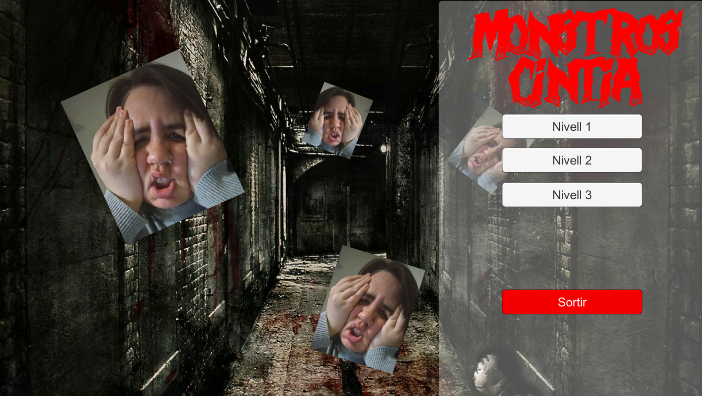

Monstros Cintia | Unity
======================

A game of a ball that collects things because yes!

Collect all the collectibles on the scenario before the time runs out.

---

Controls:

- AWSD to move.
- Spacebar to jump.

---

Some images:

---

Inside `Builds` folder you can find `zip` files for each version, these compressed files includes the builds with an `exe` to execute the game.

---

*Made with Unity.*